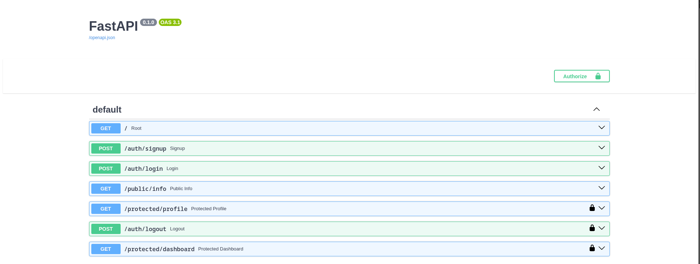

# Auth Login & Protect API

A secure authentication API built with Python, FastAPI, and Supabase Auth.

This project implements user signup, login, logout, JWT verification, protected routes, and Swagger UI documentation with Bearer Token authentication.

## Features

- User signup with Supabase Auth
- User login with email and password
- JWT access token authentication
- Protected user profile endpoint
- Protected dashboard endpoint
- Logout endpoint
- Reusable FastAPI authentication dependency
- Public endpoint
- Swagger UI with Bearer Token authentication
- Environment variables for Supabase credentials

## Tech Stack

- Python 3.10+
- FastAPI
- Supabase
- Pydantic
- Uvicorn
- python-dotenv

## Project Structure

.
├── images/
│   └── swagger-auth.png
├── main.py
├── .env.example
├── .gitignore
└── README.md

## Environment Setup

Create a `.env` file in the project root:

SUPABASE_URL=your_project_url
SUPABASE_KEY=your_anon_key
PORT=8000

Replace the placeholder values with your own Supabase project credentials.

Never commit your `.env` file or real credentials to GitHub.

## Installation

Clone the repository:

git clone YOUR_GITHUB_REPOSITORY_URL

cd YOUR_PROJECT_DIRECTORY

Install the dependencies:

pip install fastapi uvicorn supabase python-dotenv

## Run the API

Start the server:

uvicorn main:app --reload --port 8000

The API will be available at:

http://127.0.0.1:8000

Swagger UI:

http://127.0.0.1:8000/docs

## API Reference

| Method | Endpoint | Authentication |
|---|---|---|
| POST | `/auth/signup` | No |
| POST | `/auth/login` | No |
| POST | `/auth/logout` | Yes |
| GET | `/public/info` | No |
| GET | `/protected/profile` | Yes |
| GET | `/protected/dashboard` | Yes |

## Authentication Flow

Client
  |
  | Signup / Login
  v
Supabase Auth
  |
  | Access Token (JWT)
  v
FastAPI
  |
  | Authorization: Bearer <token>
  v
Authentication Dependency
  |
  | Verify token with Supabase
  v
Protected Endpoint

## Signup

Create a new user account using:

POST /auth/signup

Request body:

{
  "email": "test@example.com",
  "password": "password123"
}

Successful signup returns:

201 Created

## Login

Authenticate an existing user using:

POST /auth/login

Request body:

{
  "email": "test@example.com",
  "password": "password123"
}

A successful login returns an access token and refresh token.

Example response:

{
  "access_token": "YOUR_ACCESS_TOKEN",
  "refresh_token": "YOUR_REFRESH_TOKEN"
}

## Protected Routes

Protected endpoints require a valid Bearer token:

Authorization: Bearer <access_token>

### Profile

GET /protected/profile

Returns authenticated user information.

### Dashboard

GET /protected/dashboard

Returns dashboard information for the authenticated user.

Invalid or expired tokens return:

401 Unauthorized

## Logout

Logout endpoint:

POST /auth/logout

It requires authentication:

Authorization: Bearer <access_token>

Successful logout returns:

204 No Content

## Public Endpoint

The following endpoint does not require authentication:

GET /public/info

Response:

{
  "message": "Welcome stranger! This info is public."
}

## Swagger UI

FastAPI automatically provides interactive API documentation.

Open:

http://127.0.0.1:8000/docs

Use the Authorize button to provide your Bearer token and test protected endpoints directly from Swagger UI.

## Status Codes

| Status Code | Meaning |
|---|---|
| 200 | Successful request |
| 201 | User created successfully |
| 204 | Logout successful |
| 400 | Invalid or missing input |
| 401 | Authentication required or invalid credentials/token |

## Security

Supabase manages authentication and issues JWT access tokens.

The FastAPI application verifies access tokens using Supabase before allowing access to protected endpoints.

Authentication logic is implemented as a reusable FastAPI dependency so multiple protected routes can use the same security check.

Environment variables are stored in `.env`.

The `.env` file is excluded from Git using `.gitignore`.

A `.env.example` file is included with placeholder values so another developer can configure their own Supabase credentials.

## Testing

The authentication flow was tested using:

- FastAPI Swagger UI
- curl
- Supabase Auth

Tested scenarios include:

- User signup
- Successful login
- Invalid login credentials
- Public endpoint access
- Protected endpoint without a token
- Protected endpoint with a valid token
- Protected endpoint with an invalid token
- Logout

## Git Commits

The project was developed incrementally through the following stages:

- Stage 0: setup server and supabase client
- Stage 1: signup and login routes working
- Stage 2: public route and unverified protected route
- Stage 3: profile route token verification
- Stage 4: auth middleware and logout endpoint
- Stage 5: Swagger UI documentation with bearer auth
- Stage 6: publish to GitHub and write README

## Author

Ibrahim Elsaied